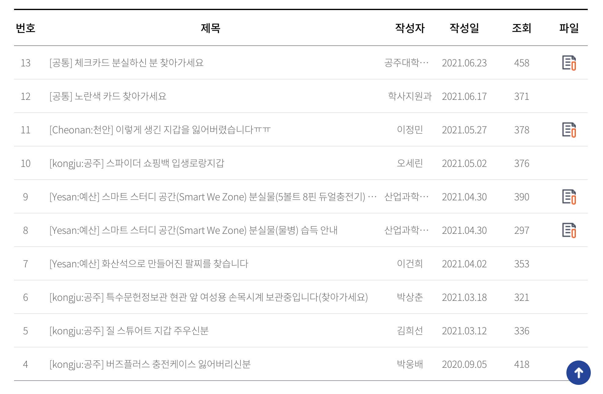
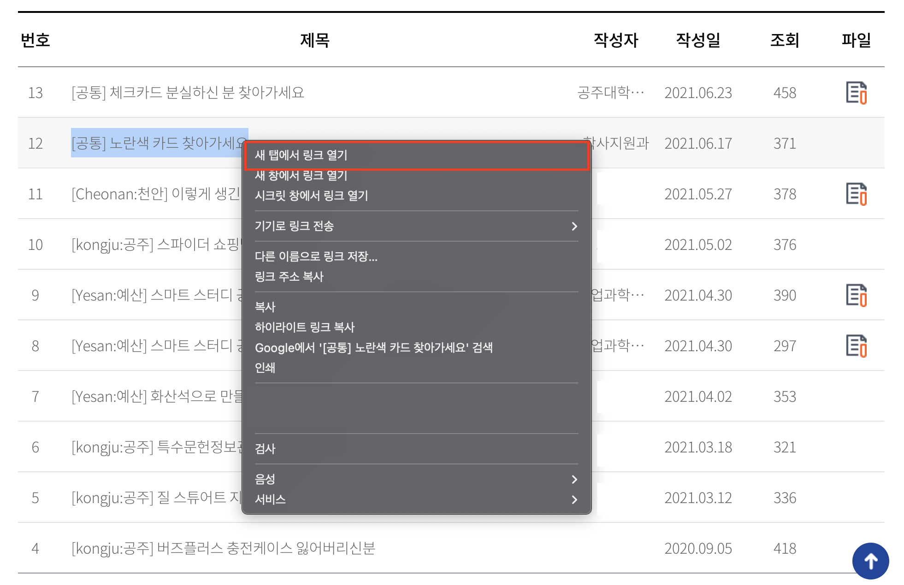
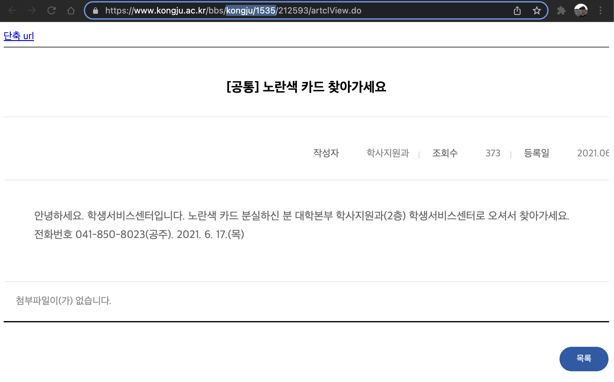
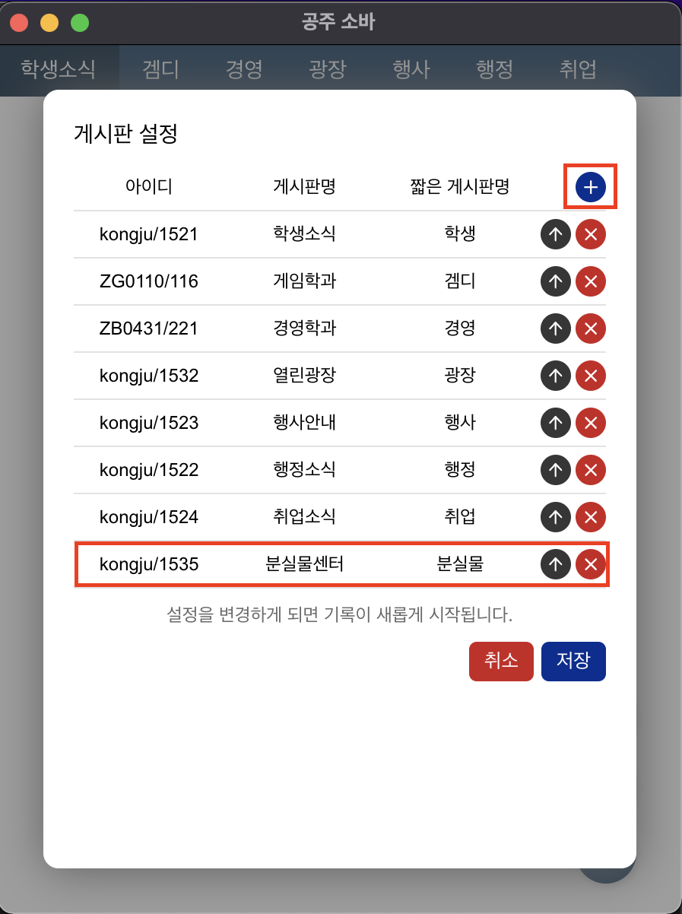
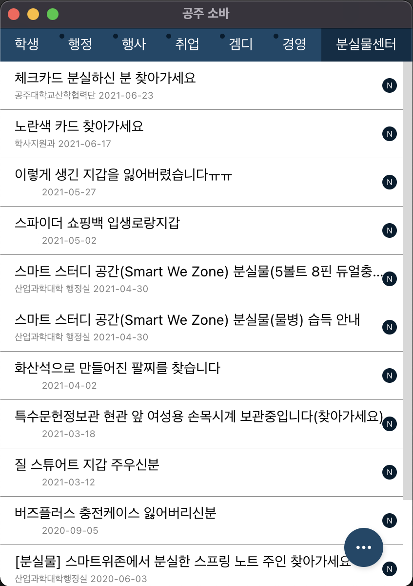

# 공주소바

[1. Hello!](#1-hello)   
[2. 작동 방식](#2-작동-방식)   
[3. 게시판 설정](#3-게시판-설정)   
&nbsp;&nbsp;&nbsp;&nbsp;[3.1. 게시판 추가](#31-게시판-추가)   
[4. 공주소바 설치 및 시작 프로그램으로 지정](#4-공주소바-설치-및-시작-프로그램으로-지정)   
&nbsp;&nbsp;&nbsp;&nbsp;[4.1. Windows](#41-windows)   
&nbsp;&nbsp;&nbsp;&nbsp;[4.2. Mac](#42-mac)

## 1. Hello!

공주소바는 [공주대학교](https://www.kongju.ac.kr/sites/kongju/index.do)의 소식을 바로바로 알려주는 데스크탑 앱입니다.

## 2. 작동 방식

사용자가 앱을 실행하게 되면 공주대학교 게시판을 크롤링하여 게시글의 정보를 보여줍니다.

각 게시판마다 마지막으로 업데이트 했던 게시글 이후의 게시글만을 표시합니다.

구독을 원하는 게시판은 설정창을 통해 변경 가능하며, 그 경우 기록이 새롭게 시작됩니다.

## 3. 게시판 설정

우측 하단의 메뉴 버튼 클릭 후, 설정 버튼을 누르게 되면 게시판 설정창이 표시됩니다.

해당 설정창에서는 게시판의 위치, 게시판명, 짧은 게시판명을 변경할 수 있습니다.

또한, 게시판 추가가 가능합니다.

게시판 아이디는 사용자가 아래의 방법을 따라 찾을 수 있습니다.

### 3.1. 게시판 추가

1. 공주대 게시판 접속   
아래의 형식을 가진 공주대 게시판이라면 어느 게시판이라도 가능합니다. (학과 게시판 등)

2. 게시글의 글 중 하나의 제목을 우클릭 → '새 탭에서 링크 열기' 클릭

3. 새 탭에 열린 게시판 글의 링크 부분 중 아이디 선택   
아이디는 'bbs/' 와 '/숫자(글 고유 번호)/artclView.do' 사이에 있는 부분입니다.   
[예시: 분실물센터] https://kongju.ac.kr/bbs/<strong><u>kongju/1535</u></strong>/212592/artclView.do   
[예시: 게임디자인학과] https://game.kongju.ac.kr/bbs/<strong><u>ZG0110/116</u></strong>/249572/artclView.do

4. 공주소바 엡의 우측 하단의 메뉴 버튼 클릭 → 설정 버튼 클릭
5. '+' 버튼 클릭
6. 아이디와 게시판명, 짧은 게시판명을 입력

7. 저장 버튼 클릭
8. 게시판 게시글 확인

## 4. 공주소바 설치 및 시작 프로그램으로 지정

### 4.1. Windows

1. [공주소바 릴리즈 페이지](https://github.com/yucheon6000/kongju-soba/releases)에서 최신 버전의 .exe 파일을 다운로드합니다.
2. .exe 파일을 실행하여 공주소바의 설치를 진행합니다.
3. (선택) 시작프로그램으로 설정하기 위해서는 [Windows 시작 프로그램 지정](https://prolite.tistory.com/1102)을 따라 진행하시면 됩니다.

### 4.2. Mac

1. [공주소바 릴리즈 페이지](https://github.com/yucheon6000/kongju-soba/releases)에서 최신 버전의 .dmg 파일을 다운로드합니다.
2. .dmg 파일을 실행하여 Application 폴더로 공주소바 앱을 이동시킵니다.
3. 공주소바 실행 시, 경고가 발생됩니다. 이를 해결하기 위해서는 [Mac에서 앱 안전하게 열기](https://support.apple.com/ko-kr/HT202491)의 '**공증을 받지 않은 앱이나 확인되지 않은 개발자가 제공한 앱을 열려는 경우**' 부분을 따라 진행하시면 됩니다.
4. (선택) 시작프로그램으로 설정하기 위해서는 [Mac 시작 프로그램 지정](https://comeinsidebox.com/%EB%A7%A5-%EC%8B%9C%EC%9E%91%ED%94%84%EB%A1%9C%EA%B7%B8%EB%9E%A8/)을 따라 잔행하시면 됩니다.